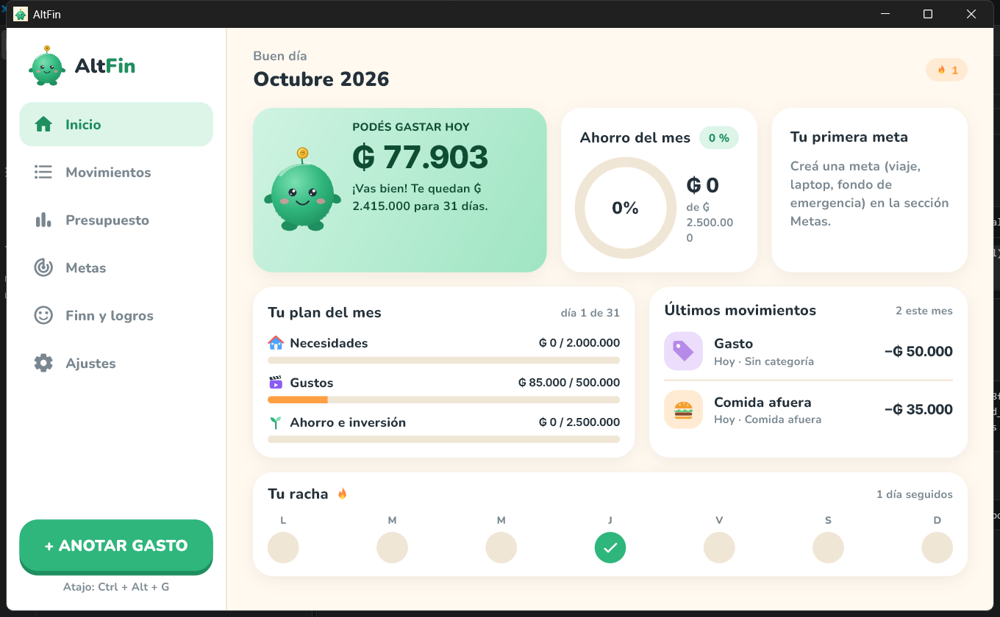
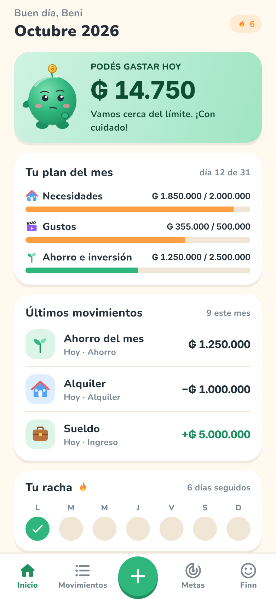
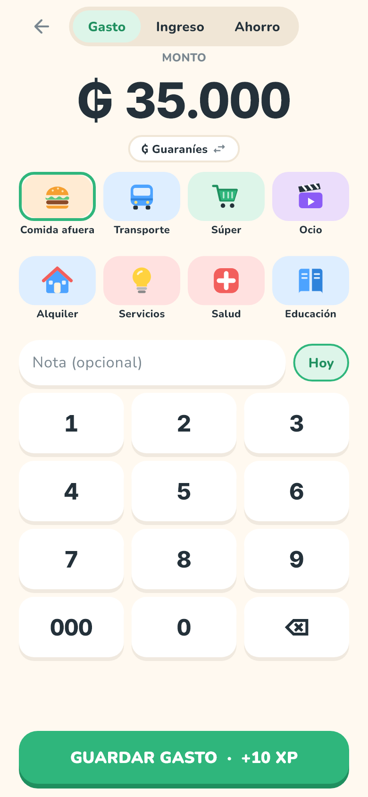
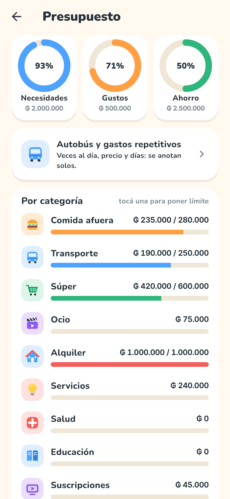
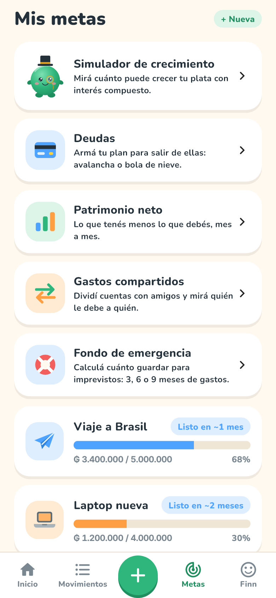
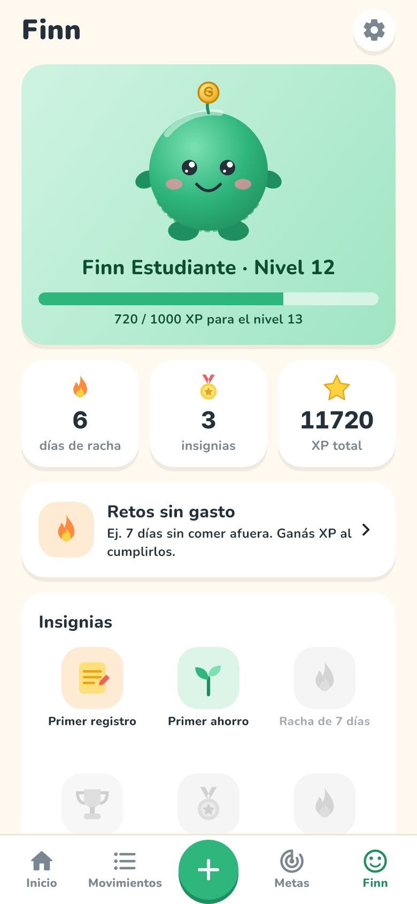
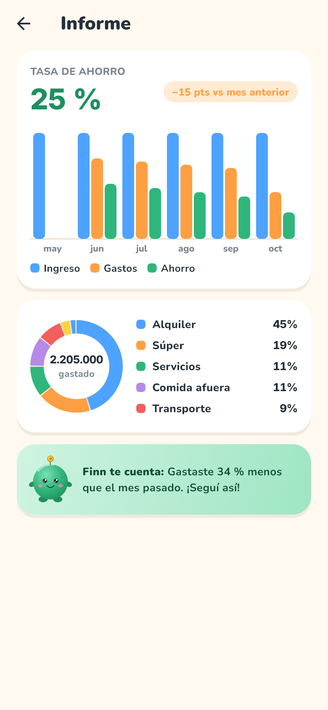
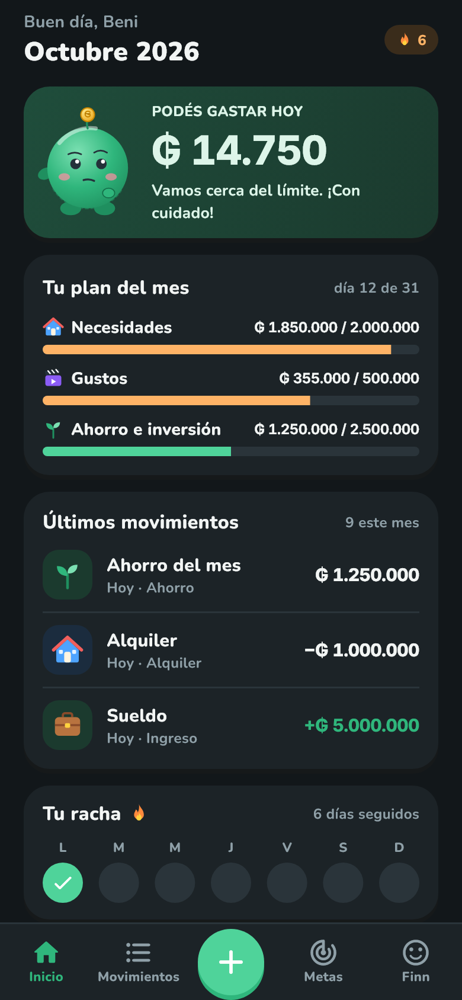
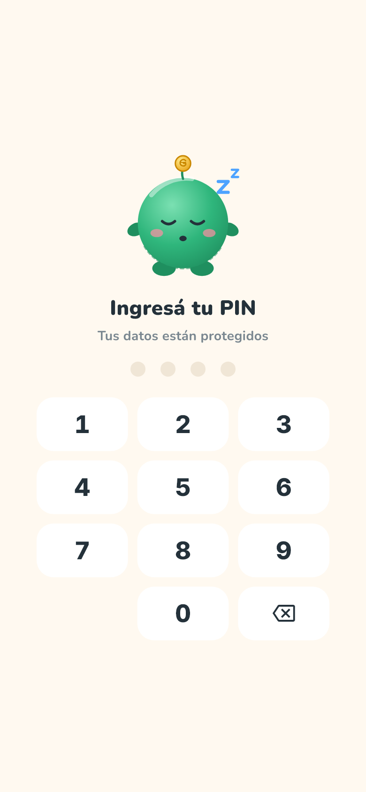

<div align="center">

# AltFin

**Finanzas personales con Finn, tu mascota. Local, sin cuenta, de código abierto.**

Planificá tu sueldo, ahorrá el 50 % y mirá crecer tu plata, en guaraníes (₲) y dólares (US$).

[](https://github.com/BenjaminSVG/altfin/actions/workflows/ci.yml)
[](LICENSE)




</div>

> **English TL;DR** — AltFin is an offline-first personal finance app (Flutter, Android + Windows) built around one idea: *save 50 % of your salary*. You enter your monthly income, pick a savings profile (Rocket 50 % or Balanced 30 %) and the app tells you how much you can spend **today**. A friendly plush mascot, **Finn**, gamifies logging expenses (streaks, XP, badges, reminders). All data stays on your device (SQLite); no account, no server, no tracking. Spanish (Paraguay) UI, ₲ PYG and US$ USD supported. MIT licensed. Contributions welcome, see [CONTRIBUTING.md](CONTRIBUTING.md).

## ¿Qué es AltFin?

La mayoría de las apps de finanzas controlan tus gastos. AltFin va un paso más: te ayuda a **hacerte más rico**. Parte de una regla simple, ahorrar la mitad de tu sueldo, y te acompaña todos los días para que anotes tus gastos sin culpa, con una mascota amigable.

- **Tu sueldo, repartido:** Modo Cohete (40 % necesidades · 10 % gustos · **50 % ahorro/inversión**), Equilibrado (50/20/30), **Personalizado** (tus porcentajes, incluso 0 % de ahorro) o **Sin porcentaje**. Nada es obligatorio: el sueldo y el porcentaje se pueden **omitir** (por ejemplo, si estás sin trabajo) y cargar cuando quieras.
- **"Hoy podés gastar ₲ X":** un número claro, calculado con lo que te queda del mes.
- **Anotar en 3 toques** (o con el teclado en PC: `Ctrl+N`, números, `Enter`).
- **Presupuesto por categoría** con barras verde → naranja → rojo.
- **Metas de ahorro** y **simulador de interés compuesto** (cuánto crece tu plata en 10 años).
- **Gastos fijos** (alquiler, internet, Netflix) que se anotan solos el día de cobro.
- **Autobús y gastos repetitivos** (merienda, café...): elegís cuántas veces al día, el precio y los días de la semana, y se anotan solos.
- **Fondo de emergencia, patrimonio neto, gastos compartidos y retos sin gasto** (ver CHANGELOG).
- **Widgets de pantalla (Android):** Anotar gasto, Podés gastar hoy y Racha.
- **Plan de pago de deudas**: método avalancha (menos intereses) o bola de nieve (más motivación), con pago extra y fecha estimada para quedar libre de deudas.
- **Informe** de 6 meses, tasa de ahorro y gastos por categoría.
- **Finn y la gamificación:** racha diaria, XP, niveles, insignias y recordatorios con su voz.
- **Privacidad primero:** todo se guarda en tu dispositivo. Sin cuenta, sin internet, sin anuncios. Bloqueo con PIN, **copia de seguridad** y exportación a **CSV**.
- Modo oscuro y diseño adaptable (celular y PC).

> AltFin es una herramienta de organización y educación. **No es asesoría financiera.** Las simulaciones son orientativas.

## Capturas

| Inicio | Anotar gasto | Presupuesto | Metas |
|:--:|:--:|:--:|:--:|
|  |  |  |  |

| Finn y logros | Informe | Modo oscuro | Bloqueo con PIN |
|:--:|:--:|:--:|:--:|
|  |  |  |  |

Las capturas se generan con datos de ejemplo. El diseño completo (mockups, sistema de diseño, iconos y la hoja de personaje de Finn) está en [`diseno/`](diseno/).

## Estado del proyecto

Versión **0.3.0 (alfa)**. Funciona y está probada (80 pruebas automáticas, y uso real en Windows), pero todavía le faltan cosas. Ver la [hoja de ruta](#hoja-de-ruta).

| Plataforma | Estado |
|---|---|
| Windows | ✅ Probada (usar la compilación *Release*) |
| Android | 🟡 Compila (APK de prueba); sin probar en teléfono real |
| iOS / macOS | ❌ Fuera de alcance por ahora |
| Linux / Web | ❌ No soportados |

## Instalación y uso

### Requisitos

- [Flutter](https://docs.flutter.dev/get-started/install) estable (3.4x o superior; Dart ≥ 3.13)
- Windows: Visual Studio 2022 con "Desarrollo de escritorio con C++"
- Android: Android SDK (se instala con Android Studio)

### Ejecutar

```bash
git clone https://github.com/BenjaminSVG/altfin.git
cd altfin/app
flutter pub get
dart run build_runner build --delete-conflicting-outputs   # solo si cambiás la base de datos

# Windows (usar release; la compilación debug puede colgarse en algunos equipos)
flutter build windows --release
# → app\build\windows\x64\runner\Release\altfin.exe

# Android
flutter build apk --debug
```

### Pruebas

```bash
cd app
flutter analyze
flutter test
ALTFIN_SCREENSHOTS=1 flutter test test/app_flows_test.dart   # además regenera las capturas
```

## Cómo está hecha

- **Flutter / Dart**: un solo código para Android y Windows, compilado a nativo.
- **Dominio puro** (`app/lib/domain`): dinero siempre en **enteros** (guaraníes o centavos de dólar, nunca `double`), reparto del sueldo, interés compuesto, metas, rachas, PIN, CSV… sin dependencias de Flutter y con pruebas.
- **Datos locales**: [Drift](https://drift.simonbinder.eu/) sobre SQLite. Una sola base de datos en el dispositivo.
- **Estado**: [Riverpod](https://riverpod.dev/).
- **Interfaz**: Material 3 con un sistema de diseño propio (colores, tipografía Nunito + Inter, iconos propios en SVG).

Más detalle en [docs/ARQUITECTURA.md](docs/ARQUITECTURA.md).

```
altfin/
├─ app/          Proyecto Flutter (lib/domain, lib/data, lib/features, lib/ui, test/)
├─ diseno/       Mockups, sistema de diseño, iconos, hoja de personaje de Finn, capturas
├─ docs/         Arquitectura, plan inicial y análisis de referencias
└─ .github/      CI y plantillas
```

## Hoja de ruta

- [ ] Notificaciones en Windows (hoy solo Android)
- [x] Plan de pago de deudas (avalancha / bola de nieve)
- [ ] Huella digital además del PIN
- [x] Widgets de pantalla en Android (probados solo en compilación; falta probarlos en un celular)
- [ ] Atajo global en PC
- [ ] Animaciones de Finn (Rive) y atuendos por nivel
- [ ] Carteras de inversión y patrimonio neto
- [ ] Más idiomas (inglés, guaraní) y más monedas
- [ ] Pruebas en teléfonos reales y publicación en tiendas

¿Querés ayudar? Mirá los [issues](https://github.com/BenjaminSVG/altfin/issues) con la etiqueta `good first issue`.

## Contribuir

¡Las contribuciones son bienvenidas! Leé [CONTRIBUTING.md](CONTRIBUTING.md) y el [Código de conducta](CODE_OF_CONDUCT.md). Para reportar una vulnerabilidad, ver [SECURITY.md](SECURITY.md).

## Licencia y créditos

- Código y arte (incluidos Finn y los iconos): [MIT](LICENSE).
- Tipografías **Nunito** e **Inter**: [SIL Open Font License 1.1](THIRD_PARTY_NOTICES.md).
- Dependencias de Dart/Flutter: ver [THIRD_PARTY_NOTICES.md](THIRD_PARTY_NOTICES.md).
- El diseño se inspiró en ideas de YNAB, Monarch, Wallet, Spendee, Fintual, Duolingo y Finch. AltFin no está afiliada a ninguna de ellas ni usa sus marcas o imágenes.
